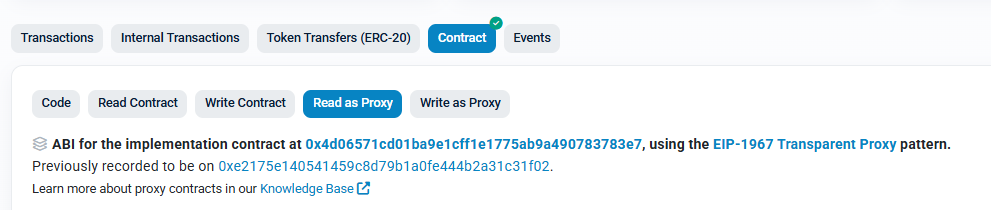
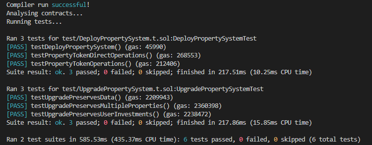
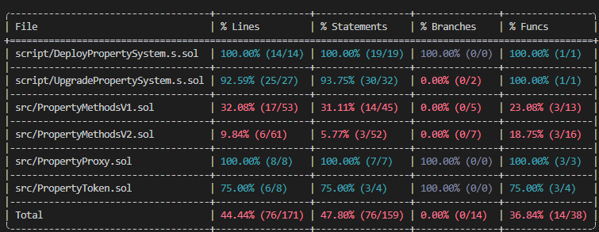

# 🏗️ Real Estate RWA – Proxy-Based Fractional Ownership

> **A learning project for Encode Advanced Solidity Bootcamp**  
> This Solidity project explores **upgradability** using **proxy contracts** in the context of **fractional real estate ownership**.
>
> It started as a basic ERC-1155 contract and was enhanced with **proxy patterns**, a migration from **Hardhat to Foundry**, and upgradeability support.

---

## 🏡 What is this project?

This project implements an **ERC-1155-based fractional property ownership system** where users can:

- **Create** a new property (mint an NFT representing it)
- **Buy shares** of an existing property (fractional ownership)

### 🚀 Why Upgradability?

Smart contracts are immutable by default. **Proxy contracts** allow **upgradeable logic** while **preserving user data**.

### ⚠️ Challenges & Considerations

- **Security Risks** → Poorly implemented proxies introduce vulnerabilities.
- **Trust & Governance** → Users need assurance that upgrades are in their best interest.
- **Gas Overhead** → Proxy calls have slightly higher gas costs than direct contract calls.

---

## 🏗️ Initial Setup

| Component             | Purpose                                                 |
| --------------------- | ------------------------------------------------------- |
| **PropertyToken**     | Immutable ERC-1155 Real Estate Token                    |
| **ProxyAdmin**        | Admin contract for managing upgrades                    |
| **PropertyProxy**     | Proxy contract that users interact with                 |
| **PropertyMethodsV1** | First implementation contract containing business logic |
| **PropertyMethodsV2** | New implementation with additional functionality        |

---

## 🔄 Deployment & Upgrades

### **How the Proxy Works**

- **Users always interact with the proxy address.**
- The **proxy delegates calls** to the current implementation (V1 or V2).
- Storage **remains in the proxy contract**, so data is **preserved during upgrades**.

### **Initial Deployment**

```solidity
// Deploy new implementation contract
PropertyMethodsV1 implementationV1 = new PropertyMethodsV1();

// Deploy Proxy that delegates to the implementation contract
TransparentUpgradeableProxy propertyProxy =
    new TransparentUpgradeableProxy(address(implementationV1), deployerAddr, data);
```

### **Upgrading to a New Implementation**

```
// Deploy new version of the implementation contract
PropertyMethodsV2 implementationV2 = new PropertyMethodsV2();

// Upgrade the proxy to point to the new implementation
proxyAdmin.upgradeAndCall{value: 0}(
    ITransparentUpgradeableProxy(payable(proxyAddress)), address(implementationV2), data
);
```

---

## 🔗 Contract Addresses (Sepolia Testnet)

| Contract              | Address                                      |
| --------------------- | -------------------------------------------- |
| **PropertyToken**     | `0xF033FecBb9072438C23c64b203cE616AE15BCa9b` |
| **PropertyMethodsV1** | `0xE2175e140541459C8D79B1A0fe444B2A31c31F02` |
| **PropertyProxy**     | `0x7DEf8e8E03051bBCF7FCCaB8859345616aED8468` |
| **PropertyMethodsV2** | `0x4d06571cd01ba9e1cff1e1775ab9a490783783e7` |

### **Proxy Contract Confirmation**

The screenshot below confirms that our proxy contract follows the **EIP-1967 Transparent Proxy pattern**, ensuring that:

- **Storage remains intact** while upgrading.
- **Users continue interacting with the same proxy address**.
- **The implementation logic can be changed** without affecting user data.



To verify the proxy contract yourself, visit **[Sepolia Etherscan Proxy Contract Page](https://sepolia.etherscan.io/address/0x7DEf8e8E03051bBCF7FCCaB8859345616aED8468)**.

---

## ⚡ Quickstart

### Clone the repository

```
git clone https://github.com/marina-ciuperca/marina-rwa
cd marina-rwa
forge build
```

### Deploy to Localhost

```
forge script script/DeployPropertySystem.s.sol --rpc-url http://127.0.0.1:8545 --private-key --broadcast -vv
```

### Upgrade Locally

```
forge script script/UpgradePropertySystem.s.sol --rpc-url http://127.0.0.1:8545 --private-key --broadcast -vv
```

---

## ✅ Testing & Coverage





**_Since the primary focus was proxy implementation, coverage was prioritized for relevant functionality._**

---

## 🔑 Key Takeaways

✅ Proxy Contract Holds All Storage → Upgrades do not affect user balances.

✅ Users Always Interact with the Proxy Address → The logic contract can change, but the interface remains the same.

✅ Storage Layout Must Be Maintained → When upgrading, storage variables must remain in the same order.

✅ The ERC-1155 PropertyToken is Immutable → Only the business logic (PropertyMethods) can be upgraded.

---

## 👥 Contributors

@simonroope [Simon Roope](https://github.com/simonroope)

@moojing [Mu-Jing-Tsai](https://github.com/moojing)

@marina-ciuperca [Marina Ciuperca](https://github.com/marina-ciuperca)

## 🚀 Acknowledgment

This project is a learning initiative. The proxy for our Real Estate contract leverages OpenZeppelin's ERC1967 Transparent Upgradeable Proxy for security and upgradeability. Additionally, our base contract is derived from and modified from the open-source repository:

🔗
[EVM Real Estate Tokenized](https://github.com/Agent009/evm-real-estate-tokenised)
